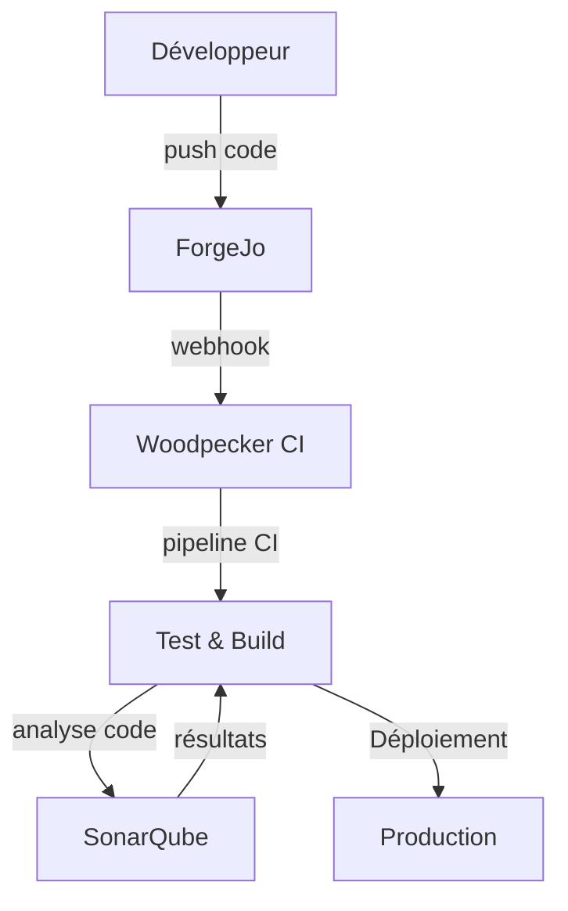

## Objectifs DevOps

- Centraliser le développement collaboratif sur un Git auto-hébergé
- Automatiser les tests, builds et déploiements via CI/CD
- Garantir la qualité du code avec une analyse statique continue

---

## 🔧 ForgeJo

### Description
**ForgeJo** est une forge logicielle auto-hébergée dérivée de Gitea, idéale pour héberger des dépôts Git légers avec interface web, gestion des issues, pull requests, et intégration avec CI/CD.

### Détails techniques
- Déployé en conteneur (`forgejo`)
- Fonctionnalités :
  - Dépôts Git privés/publics
  - Webhooks pour CI (Woodpecker)
  - Gestion fine des droits

📘 [Documentation ForgeJo](outils-devops/forgejo.md)

---

## 🔁 Woodpecker CI

### Description
**Woodpecker CI** est une solution légère et efficace d'intégration continue, compatible avec ForgeJo via webhooks. Elle permet d’exécuter des pipelines CI à chaque `push`, `PR` ou `tag`.

### Détails techniques
- Déployé en conteneur (`woodpecker`)
- Pipelines définis en YAML dans chaque dépôt (`.woodpecker.yml`)
- Intégration :
  - ForgeJo (authentification OAuth / token)
  - Conteneurs Docker pour l’exécution
- Exemple de pipeline :

```yaml
pipeline:
  build:
    image: node:18
    commands:
      - npm install
      - npm run build
````

📘 [Documentation Woodpecker CI](outils-devops/woodpecker-ci.md)

---

## 🧪 SonarQube

### Description

**SonarQube** est utilisé pour assurer la qualité du code et détecter les bugs, vulnérabilités et dettes techniques automatiquement après chaque build.

### Détails techniques

* Déployé en conteneur (`sonarqube`)
* Langages analysés : Python, JavaScript, Bash, etc.
* Intégration possible :

  * Analyse locale (`sonar-scanner`)
  * Automatique via Woodpecker CI

📘 [Documentation Sonarqube](outils-devops/sonarqube.md)

---

## 🔗 Workflow CI/CD typique



---
